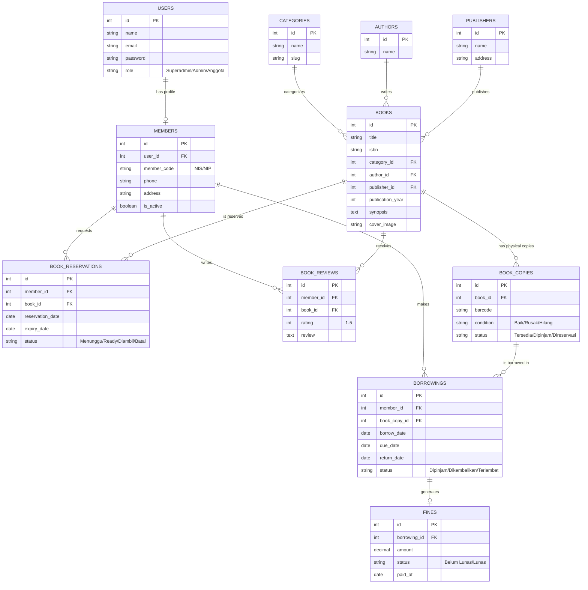

# Product Requirements Document (PRD)
## Perpustakaan SMA Angkasa Jaya

### 1. Ringkasan Produk & Tujuan
**Perpustakaan SMA Angkasa Jaya** adalah sistem informasi manajemen perpustakaan berbasis web (Laravel). Aplikasi ini dirancang untuk mendigitalisasi proses operasional harian perpustakaan, menggantikan pencatatan manual yang rentan terhadap human error dan tidak efisien. 
**Tujuan Utama:**
- Mempermudah pustakawan dalam mengelola inventaris buku, peminjaman, dan pengembalian.
- Memberikan akses kepada anggota (siswa dan guru) untuk mencari buku, melihat ketersediaan, mereservasi, dan memberikan ulasan terhadap buku.
- Menghasilkan laporan statistik otomatis mengenai aktivitas perpustakaan.

### 2. Target Pengguna & Role
Sistem ini melayani dua jenis pengguna utama dengan hak akses (role) yang berbeda:
1. **Admin / Pustakawan:** Staf perpustakaan yang bertugas mengelola seluruh data master (buku, anggota, penerbit, dsb.), memproses transaksi peminjaman/pengembalian, memantau denda, dan melihat laporan statistik.
2. **Anggota (Siswa/Guru):** Pengguna akhir perpustakaan yang dapat melihat katalog buku, memberikan rating dan ulasan, melihat histori peminjaman mereka sendiri, dan melakukan reservasi buku secara mandiri.

### 3. Daftar Fitur Lengkap
1. **Katalog Buku (CRUD + Pencarian/Filter):**
   Manajemen katalog buku beserta relasinya dengan kategori, penulis, dan penerbit. Anggota dapat mencari buku berdasarkan judul, penulis, atau kategori dengan filter yang responsif.
2. **Manajemen Eksemplar Buku:**
   Sistem membedakan antara entitas 'Judul Buku' dan 'Eksemplar' (fisik buku). Satu judul buku dapat memiliki banyak *copy* dengan status masing-masing (Tersedia, Dipinjam, Hilang/Rusak).
3. **Pendaftaran & Manajemen Anggota Perpustakaan:**
   Modul pengelolaan data siswa dan guru yang terdaftar sebagai anggota perpustakaan, terintegrasi dengan akun login sistem (User).
4. **Peminjaman & Pengembalian Buku:**
   Proses inti transaksi perpustakaan di mana admin mencatat pengeluaran eksemplar buku kepada anggota tertentu dengan batas waktu pengembalian.
5. **Perhitungan Denda Otomatis:**
   Sistem secara otomatis menghitung akumulasi denda harian jika buku dikembalikan melewati batas tenggat waktu (*due date*).
6. **Reservasi Buku (Booking):**
   Anggota dapat mereservasi judul buku tertentu. Jika eksemplar tersedia, status otomatis berubah menjadi "Ready" dan buku disisihkan untuk anggota tersebut dengan tenggat waktu pengambilan.
7. **Review & Rating Buku:**
   Sistem umpan balik dari anggota yang pernah meminjam buku. Rating agregat akan ditampilkan di katalog buku.
8. **Dashboard Laporan:**
   Dasbor analitik yang menyajikan ringkasan statistik (jumlah buku, anggota aktif, buku terpopuler, total peminjaman, dan total denda).

---

### 4. Skema Data & Arsitektur

#### a. Penjelasan Naratif Tabel
Aplikasi ini akan memiliki 10 tabel utama (selain `users` dan `settings` yang sudah ada) sebagai berikut:
1. **`categories`**: Menyimpan kategori/genre buku (contoh: Fiksi, Sains, Sejarah).
2. **`authors`**: Menyimpan data penulis buku.
3. **`publishers`**: Menyimpan data penerbit buku.
4. **`books`**: Tabel master untuk judul buku (katalog), memiliki relasi dengan kategori, penulis, dan penerbit.
5. **`book_copies`**: Mewakili fisik buku (*copy*) yang tersedia di perpustakaan. Berelasi ke `books` dan memiliki barcode/kode unik serta status.
6. **`members`**: Data detail anggota perpustakaan (NIS/NIP, alamat, dll). Berelasi 1-to-1 dengan tabel `users` untuk login.
7. **`borrowings`**: Tabel transaksi peminjaman. Mencatat siapa (`members`) yang meminjam eksemplar mana (`book_copies`), tanggal pinjam, tenggat kembali, dan tanggal kembali aktual.
8. **`fines`**: Tabel denda yang terhubung dengan `borrowings`. Mencatat nominal denda dan status pembayaran denda.
9. **`book_reservations`**: Tabel untuk menyimpan antrean/reservasi. Anggota mereservasi `books` (bukan copy spesifik). Status dapat berupa "Menunggu", "Tersedia/Ready", "Diambil", atau "Batal".
10. **`book_reviews`**: Ulasan dan rating bintang (1-5) dari `members` untuk suatu `books`.

#### b. Visualisasi ERD

---

### 5. User Flow Utama

**A. Alur Peminjaman Buku:**
1. Anggota datang ke perpustakaan membawa buku fisik.
2. Pustakawan memindai ID/Barcode Anggota di sistem.
3. Pustakawan memindai Barcode pada `book_copies`.
4. Sistem mengecek status kelayakan anggota (tidak sedang terkena suspend atau belum bayar denda).
5. Sistem menyimpan record ke tabel `borrowings` dengan status "Dipinjam" dan menetapkan `due_date`.
6. Status `book_copies` otomatis berubah menjadi "Dipinjam".

**B. Alur Pengembalian Buku & Denda:**
1. Anggota menyerahkan buku ke pustakawan.
2. Pustakawan memindai barcode `book_copies`.
3. Sistem menemukan record `borrowings` aktif, lalu mengeset `return_date` ke hari ini.
4. Sistem membandingkan `return_date` dengan `due_date`. 
   - **Jika terlambat:** Sistem otomatis meng-generate record `fines` sesuai hitungan hari keterlambatan dikali tarif denda harian.
   - **Jika tepat waktu:** Transaksi selesai tanpa denda.
5. Status `borrowings` berubah menjadi "Dikembalikan".
6. Status `book_copies` dikembalikan menjadi "Tersedia". (Sistem juga akan mengecek apakah ada `book_reservations` yang "Menunggu" untuk buku tersebut. Jika ada, statusnya di-*update* untuk reservasi berikutnya).

**C. Alur Reservasi Buku:**
1. Anggota mencari buku di katalog website, lalu klik tombol "Reservasi".
2. Sistem mengecek tabel `book_copies` untuk buku (`book_id`) tersebut.
   - **Jika ada yang "Tersedia":** Sistem langsung mengubah status reservasi menjadi "Ready" dan "mengunci" satu eksemplar (`book_copies`) menjadi "Direservasi".
   - **Jika semua "Dipinjam":** Status reservasi diset "Menunggu". (Otomatis naik antrean jika ada yang dikembalikan).
3. Anggota mendapat tenggat waktu pengambilan (misal 1x24 jam). Jika tidak diambil melewati batas waktu, status reservasi menjadi "Batal" dan eksemplar dilepas kembali.

---

### 6. Non-Functional Requirements (NFR)
1. **Autentikasi & Autorisasi:** Sistem diakses melalui portal Login menggunakan *Laravel Authentication*. Validasi ketat dilakukan antar *roles* (Admin vs Anggota); Anggota dilarang mengakses modul CRUD inventaris perpustakaan.
2. **Kinerja (Performance):** Halaman pencarian katalog buku wajib menggunakan *indexing* database atau *caching* untuk memastikan waktu muat (*load time*) kurang dari 1 detik meski data buku mencapai lebih dari ribuan.
3. **Responsivitas Layar (UI/UX):** Dashboard dan antarmuka pengguna, khususnya pada tampilan anggota, wajib 100% responsif digunakan pada perangkat *mobile* (smartphone) maupun desktop.
4. **Keandalan (Reliability):** Data transaksi bersifat kritikal. Sistem wajib dilengkapi dengan fitur pencegahan *race condition* (contoh: dua anggota tidak boleh mereservasi eksemplar terakhir secara bersamaan). 
5. **Skalabilitas:** Arsitektur database didesain minimal untuk skala 10.000 anggota aktif, sehingga membutuhkan penataan Foreign Keys dan tipe data yang presisi.
